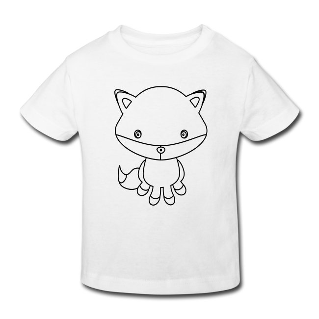
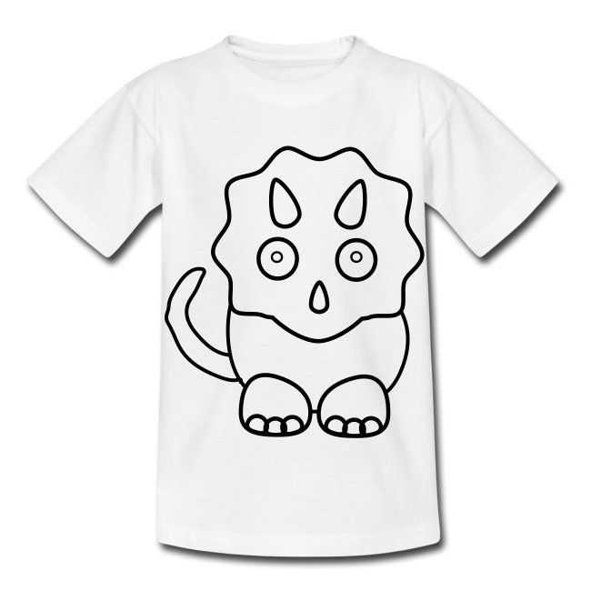

# clip art

Ursprünglich verstand man unter Clipart Illustrationen, die aus gemeinfreien Werken oder aus dafür vorgesehenen Clipart-Büchern ausgeschnitten und in eigene Kreationen eingeklebt wurden, verwandt der Collage. Dementsprechend ist der Ausdruck abgeleitet von englisch clip „ausschneiden“ und art „Kunst“.

## start

| textilien & auflösung  | beispiel | vorlage(n) |
|:--:|:--:|:--:|
|[   **Fuchs**](https://selber-ausmalen.de/shop.html#!/clip+art+4+kids+-+fuchs?idea=5edff8e7e447422bf672dc77)  |  |    [SVG](https://github.com/selber-ausmalen/designs/blob/master/clip-art/fox_v1.svg) |
|[   **Triceratops**](https://selber-ausmalen.de/shop.html#!/clip+art+4+kids+-+triceratops?idea=5edc1c59e447420dd8b8d269)  |  |    [SVG](https://github.com/selber-ausmalen/designs/blob/master/clip-art/triceratops_v1.svg) |
