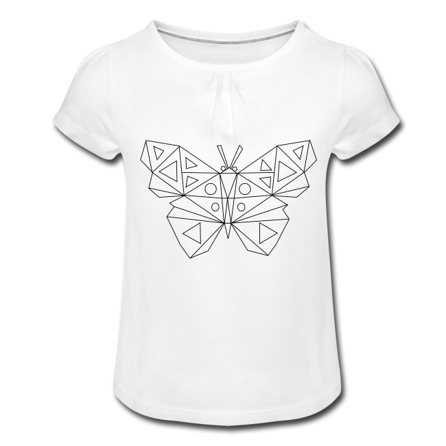
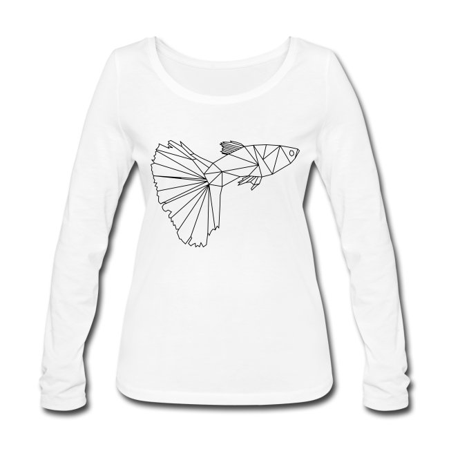
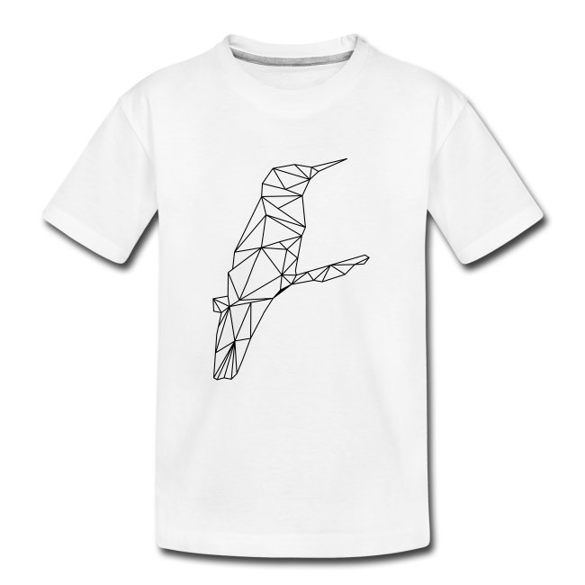
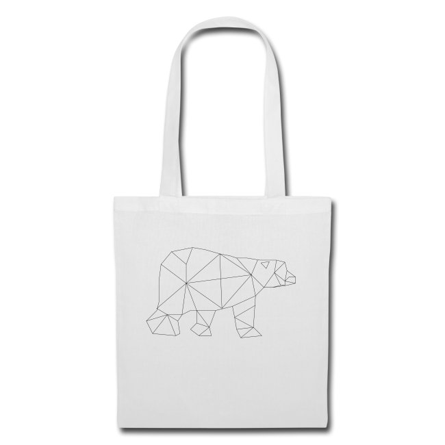

# low poly art

Low poly art verwendet Netze aus wenigen Polygonen (z.B. Dreiecken) zur graphischen Darstellung. Einfache geometrische Formen werden verbunden zu oft minimalistischen Kompositionen.

## start

| textilien & auflösung  | beispiel | vorlage(n) |
|:--:|:--:|:--:|
|[   **Schmetterling**](https://selber-ausmalen.de/shop.html#!/low+poly+art+-+schmetterling?idea=5ecc3a48e447421121d294b2)  |  |    [SVG](https://github.com/selber-ausmalen/designs/blob/master/low-poly-art/butterfly.svg) |
|[   **Guppy**](https://selber-ausmalen.de/shop.html#!/low+poly+art+-+guppy?idea=5ed777565fd3e4562b8216e4)  |  |    [SVG](https://github.com/selber-ausmalen/designs/blob/master/low-poly-art/guppy.svg) |
|[   **Kolibri**](https://selber-ausmalen.de/shop.html#!/low+poly+art+-+kolibri?idea=5ec7ea0222250929d5c22916)  |  |    [SVG](https://github.com/selber-ausmalen/designs/blob/master/low-poly-art/hummingbird.svg) |
|[   **Eisbär**](https://selber-ausmalen.de/shop.html#!/low+poly+art+-+eisbär?idea=5ed651d422250929d5ad326c)  |  |    [SVG](https://github.com/selber-ausmalen/designs/blob/master/low-poly-art/polar-bear.svg) |
