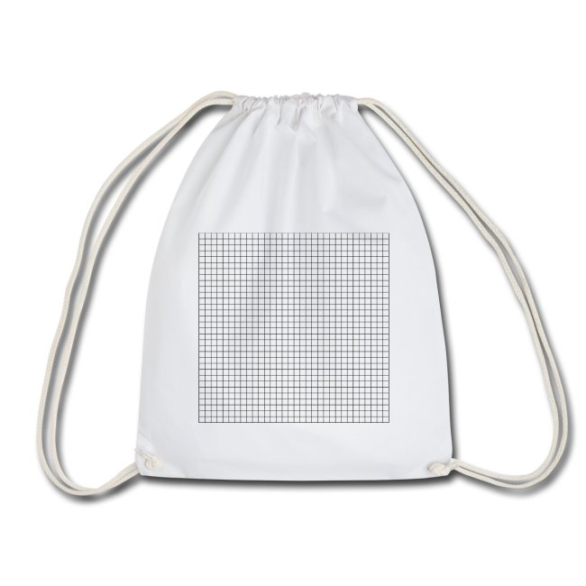

# pixel-art

Vielleicht könnt ihr euch noch an die Zeiten erinnern, in denen ihr selber als Kinder Spaß hattet mit Games auf der Playstation oder auf dem ersten Gameboy. Heute sind sie vielleicht technisch überholt, aber es gibt sie immer noch, die guten alten Pixelgrafiken - und erleben unter Kultstatus ihr Comeback. [selber-ausmalen.de](https://selber-ausmalen.de) zeigt, wie ihr die coolen alten Zeiten wieder aufleben lassen könnt. Hier findet ihr kostenlose Vorlagen zur Gestaltung eurer Lieblings-Pixelgrafiken - entweder auf Papier oder auf Textil!



## informationen

[Pixel-Art](https://de.m.wikipedia.org/wiki/Pixel-Art) ist eine Stilrichtung in der Computerkunst, die Rastergrafiken verwendet und dabei das beschränkte Auflösungsvermögen von Bildschirmen als Stilmittel bewusst herausstellt. Sie nimmt dabei – teils ironisch – Bezug auf die Anfänge der Bildschirmgrafik von Video- und Computerspielen sowie der grafischen Benutzeroberflächen von Computern in den 1980er und frühen 1990er Jahren.

## start

| textilien & auflösung (BxH)  | ideen | vorlagen |
|:--:|:--:|:--:|
|[   **8x8**](https://selber-ausmalen.de/shop.html#!/pixel-art+-+8x8+-+black?idea=5ec82c6122250929d5c62c7e)  | |    [SVG](https://github.com/selber-ausmalen/designs/blob/master/pixel-art/8x8.svg)   [PNG](https://selber-ausmalen.de/designs/pixel-art/8x8.png) |
|[   **16x16**](https://selber-ausmalen.de/shop.html#!/pixel-art+-+16x16+-+black?idea=5ec599b5e447421121711b63) | |    [SVG](https://github.com/selber-ausmalen/designs/blob/master/pixel-art/16x16.svg)   [PNG](https://selber-ausmalen.de/designs/pixel-art/16x16.png) |
|[   **32x32**](https://selber-ausmalen.de/shop.html#!/pixel-art+-+32x32+-+black?idea=5ec83141e447421121b468e1) | |    [SVG](https://github.com/selber-ausmalen/designs/blob/master/pixel-art/32x32.svg)   [PNG](https://selber-ausmalen.de/designs/pixel-art/32x32.png) |

## weitere videos





## weitere ideen

